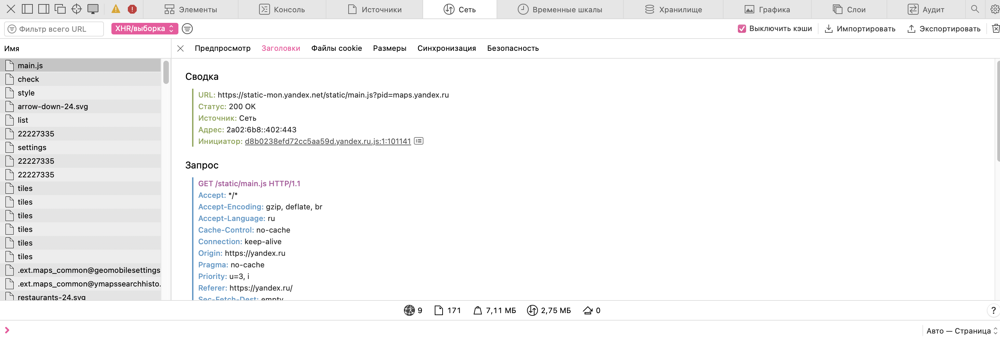
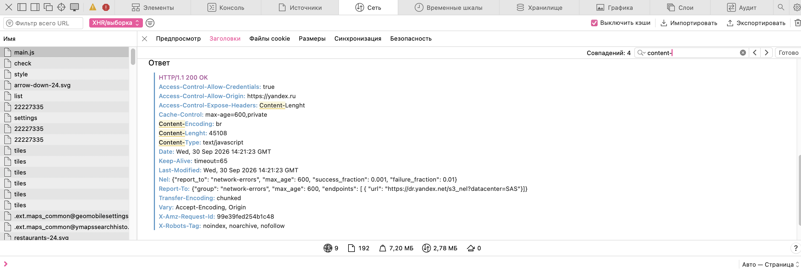
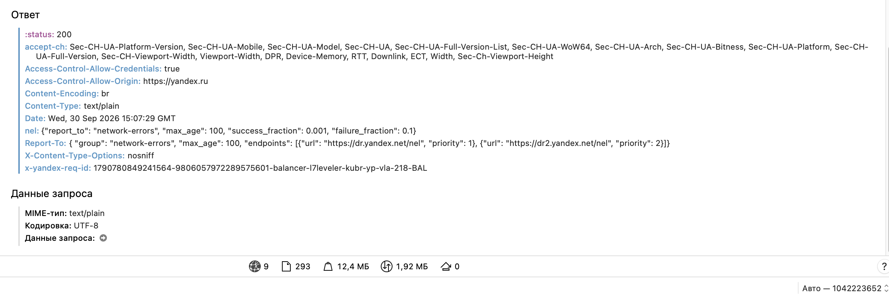
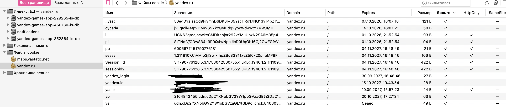
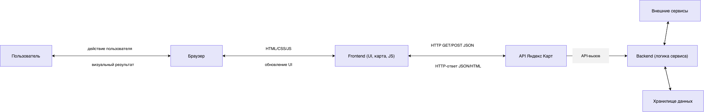

# computer-science-lab2
лабораторная работа 2

# Лабораторная работа №2

## Анализ веб-приложения и клиент-серверного взаимодействия

## 1. Исследуемая информационная система

Для выполнения работы был выбран картографический сервис - Яндекс Карты и пользовательский сценарий: поиск организации и построение маршрута от нее.

Яндекс Карты — это популярный поисково-информационный геосервис, с помощью которого можно смотреть карты городов, находить нужные организации и строить маршруты.

В ходе исследования были выделены следующие основные компоненты:

- браузер пользователя;
- интерфейс карты (главной страницы)
- клиентский JavaScript 
- API-сервис, принимающий запросы от клиента;
- хранилище базы данных, графы дорог и каталог
- внешние сервисы и ресурсы (CDN, георесурсы и авторизация через Яндекс ID).

### 1.1. Сценарий исследования

Последовательность действий:

- Открыть страницу Яндекс Карты
- Нажать на строку Поиск и выбор мест
- Написать НИУ "МИЭТ" или любую альтернативу
- Выбрать нужную строку
- В окне отображения места нажать на кнопку маршрут
- Написать изначальное положение или выбрать на карте
- При необходимости выбрать самый удобный вариант

## 2. Анализ HTTP-запросов

Чаще всего используются GET запросы и POST

GET используются для загрузки геолокаций и поиска организаций, а также для расчета маршрутов.

POST используется для более сложных сценариях, где пользователь оставляет отзывы или оценки, редактирование карт самостоятельно.

В зависимости от запрашиваемой функции, фронтенд обращается к разным поддоменам Яндекса:

- https://api-maps.yandex.ru/ — инициализация и загрузка кода самого JavaScript API (версий 2.1 или 3.0).

- https://geocode-maps.yandex.ru/ — шлюз геокодера (перевод адресов в координаты и обратно).

- https://yandex.net (или аналогичные CDN-хосты *.maps.yandex.net) — высокораспределенные сервера, отдающие непосредственно растровые или векторные плитки карты (тайлы).

- https://suggest-maps.yandex.ru/ — сервис поисковых подсказок (саджест), срабатывающий на каждый введенный символ в строке поиска.

К API запросам относятся геопозиция, маршрутизация и поиск.

Как файлы загружаются такие ресурсы как карты, иконки мест или панорамы с фото.

### 3. Анализ HTTP - ответов

Для запроса загрузки страницы  был получен ответ со статусом 200 OK. Это указывает на успешную загрузку
страницы, после чего браузер начал рендерить интерфейс.

Основные наблюдаемые заголовки:

- Content-Type: text/javascript
- Cache-Control: max-age=600,private
- Date: Wed, 30 Sep 2026 14:21:23 GMT

я искала кучу лет эти превью с пост и ниче не нашла

## 4. Анализ параметров и передаваемых данных

В запросах, связанных с поиском места, можно было выделить следующие типы параметров:

В заголовках:

- Версия браузера 

- Кодировка браузера 

- Content-Type (application/json, application/x-www-form-urlencoded)

- Идентификатор сессии (cookie)

### 5. Анализ cookies

В Яндекс Картах файлы cookie применяются для сохранения ваших личных настроек, авторизации и сбора аналитики о работе сервиса.
Для чего нужны куки на Яндекс Картах:

- Сохранение настроек: запоминают выбранный вами город, язык интерфейса, масштаб и тип отображения карты (схема, спутник или гибрид).

- Авторизация: позволяют не входить в аккаунт Яндекса заново каждый раз, когда вы открываете карты, сохраняя доступ к вашим сохраненным местам, «Избранному» и истории поисковых запросов.

- Персонализация и геоданные: помогают быстрее определять ваше примерное местоположение и предлагать актуальные местные организации, пробки или маршруты.

- Аналитика: собирают обезличенные данные о том, как пользователи взаимодействуют с интерфейсом, что помогает разработчикам улучшать стабильность и скорость работы сервиса.

- Реклама: могут использоваться экосистемой Яндекса для показа релевантных геотаргетированных 
предложений и баннеров.

### 6. Анализ взаимодействия Frontend, API и Backend

- Действие пользователя	
- Компонент интерфейса
- HTTP-запрос	
- Куда отправляется	API yandex.ru (внутренний API Яндекс.Карт)
- Передаваемые данные	text (запрос), ll (координаты), z (зум), lang; cookie сессии (скрыто)
- Ответ сервера	200 OK, JSON: items[] с title, address, coordinates, rating
- Отображение	Центрирование карты, метка, карточка организации с фото и рейтингом

### 6.1 Конкретное действие 

Рассмотрим действие: поиск организации и построение маршрута

1. Пользователь взаимодействует с UI-элементом карты 

2. Frontend реагирует на действие — JavaScript-обработчик перехватывает событие submit/click, считывает введённый текст и текущую геопозицию пользователя (или точку отправления), формирует параметры запроса.

3. Браузер отправляет запрос на API-адрес — обращение к геокодеру и маршрутизатору Яндекса

4. Backend обрабатывает данные — Геокодер находит организацию по названию, определяет её координаты и адрес; Маршрутизатор строит оптимальный путь между точкой отправления и найденной организацией с учётом дорожной ситуации, формирует геометрию маршрута, время и расстояние.

5. Сервер возвращает ответ со статусом успеха — JSON с координатами организации (GeoObject), а также объектом маршрута (Route): точки, длина, длительность, манёвры.

6. JavaScript frontend получает ответ и обновляет визуальную структуру карты — ставит метку на найденную организацию, прокладывает линию маршрута, добавляет балун с адресом и панель с деталями поездки.

7. Пользователь видит найденную организацию и построенный маршрут на карте в рабочей области, может изменить способ передвижения (авто, пешком, транспорт) или точку старта.

## 7. Сопоставление с лабороторной работой 1

По результатам первой лабораторной работы была построена предварительная архитектурная схема системы. Во второй
лабораторной она была сопоставлена с реальным сетевым поведением приложения.

Компоненты, которые удалось подтвердить:

- браузер пользователя является входной точкой взаимодействия;
- frontend загружает интерфейс, обрабатывает действия пользователя и формирует HTTP-запросы; подтверждён конкретными элементами: поле поиска, кнопка «Маршрут», рабочая область карты;
- API участвует в обмене данными между клиентом и сервером; точка входа для геопозиции и маршрутизатора;
- backend отвечает за обработку запросов и обновление состояния страницы;
- данные сохраняются в хранилище данных, а не только в памяти браузера;
- cookies используются для поддержания пользовательской сессии и некоторой служебной информации.

Компоненты, остающиеся предположительными
- Хранилище (внутреннее устройство) — виден только факт сохранения.
- API → Хранилище — прямой HTTP-связи не видно, это внутренний вызов backend.
- Backend-логика проверки прав — упоминается в сценарии, но не проявляется в HTTP-ответах как отдельный компонент.
- Внутренняя маршрутизация API — разделение «API» и «backend» условно, в наблюдении это один узел.
- Промежуточные сервисы (очереди, кэш, балансировщик) — на схеме отсутствуют и в наблюдении не проявились.

## 8. Схема взаимодействия с компонентами 

## 9. Результат работы

В ходе лабораторной работы было проведено исследование HTTP-взаимодействия на картографическом сервисе Яндекс Карты на выбранном сценарии «поиск организации и построение маршрута». Было установлено, что интерфейс работает через клиентский JavaScript, который отправляет HTTP-запросы к серверу, а сервер отвечает данными и статусами выполнения операции.

Вывод

- браузер и frontend тесно взаимодействуют для обработки ввода пользователя (поисковый запрос, выбор точки назначения) и управления картой;

- запросы к API выполняются при загрузке карты, при поиске организации и при построении маршрута;

- поиск организации и построение маршрута сопровождаются HTTP GET-запросами к Геокодеру и Маршрутизатору Яндекса и ответами сервера;

- данные передаются в URL (координаты, waypoints, ключ API) и в теле запроса (JSON), а также могут храниться в cookies (регион, язык, настройки отображения);

- обратно пользователю приходит результат (координаты организации, геометрия маршрута, время и расстояние), который обновляет интерфейс карты без полной перезагрузки страницы.
 
Подтверждено: наличие HTTP-запросов при поиске организации и построении маршрута.
Подтверждено: наличие API-взаимодействия между frontend и внешними геосервисами (Геокодер, Маршрутизатор Яндекса).
Подтверждено: использование cookies и заголовков HTTP для поддержания сессии, передачи ключа API и параметров запроса.
Подтверждено: обновление интерфейса карты после получения ответа сервера (метка, линия маршрута, балун) без полной перезагрузки страницы.
Предположительно: конкретная реализация backend геосервиса и структура внутренних сервисов (кэш маршрутов, база организаций, сервис пробок).